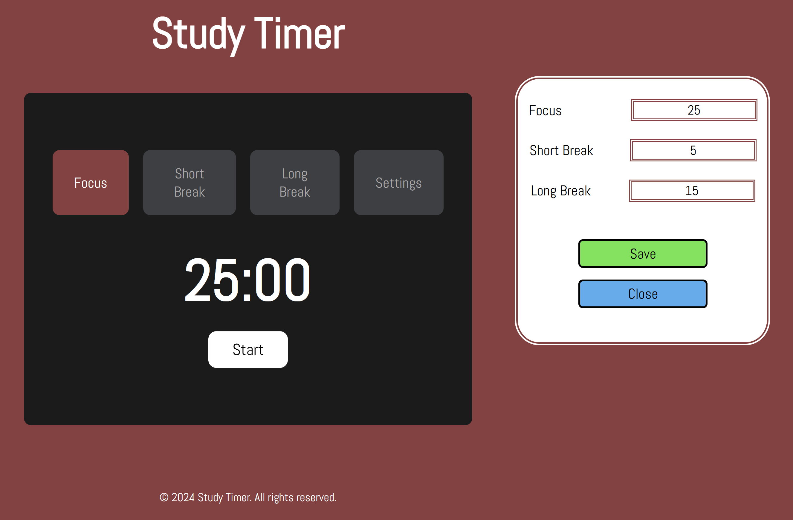

# Welcome to Study Timer !!!

## Introduction

Welcome to Study Timer! This application is designed to help you manage your study sessions effectively using the Pomodoro Technique. With Study Timer, you can customize your study and break intervals, start, stop, and reset the timer as needed to enhance your productivity.

- **Deployed Project Page:** [Study Timer](https://zealous-timer.netlify.app)
- **Final Project Blog Article:** [My Journey with Study Timer](https://www.linkedin.com/posts/activity-7216749567801774082-JqS7?utm_source=share&utm_medium=member_desktop)
- **Author's LinkedIn:** [LinkedIn Profile](https://www.linkedin.com/in/nasir-adem-degu)

## Installation

To get started with Study Timer on your local machine, follow these steps:

1. Clone the repository:
   ```bash
   git clone https://github.com/1Light/study_timer.git
   cd study-timer
   ```
2. Install the necessary dependencies:
   ```bash
   pip install -r requirements.txt
   ```
3. Set up the database:
   ```bash
   flask db init
   flask db migrate -m "Initial migration."
   flask db upgrade
   ```
4. Run the application:
   ```bash
   flask run
   ```

## Usage

Using Study Timer is simple and intuitive:

1. Open the application in your browser.
2. Set your desired study and break intervals in the settings tab.
3. Start the timer and focus on your tasks.
4. The timer will notify you when it's time for a break or to resume your study session.
5. You can stop or reset the timer at any time as needed.

## Contributing

We welcome contributions to improve Study Timer! If you have any ideas or find any issues, feel free to open a pull request or submit an issue on GitHub.

## Licensing

Study Timer is licensed under the MIT License. See the [LICENSE](LICENSE) file for more details.

## Technical Details and Story

Study Timer is a web application built with JavaScript, HTML, and CSS for the frontend, while using Flask and Python for the backend. The project stores user settings and timer logs in a MySQL database. 

### Why Study Timer?

The idea for Study Timer was born out of my personal need to manage my study sessions effectively. The Pomodoro Technique, which involves 25-minute focused work sessions followed by short breaks, has been a game-changer for my productivity. I wanted to create an app that could help others benefit from this technique as well.

### Challenges and Learnings

One of the most challenging aspects of developing Study Timer was ensuring that the timer logic functioned accurately and seamlessly. Implementing the custom settings feature required careful handling of user inputs and updating the timer dynamically based on those inputs.

Initially, I struggled with synchronizing the frontend timer display with the backend logic. I overcame this by using WebSockets to ensure real-time communication between the client and server, resulting in a smooth and responsive user experience.

Through this project, I deepened my understanding of JavaScript, Flask, and MySQL. I also learned the importance of thorough testing and user feedback in creating a reliable application.

### Future Iterations

In future iterations, I plan to add features like user authentication, detailed analytics of study sessions, and integration with calendar apps to provide a more comprehensive productivity tool.

## About the Author

I am a passionate software developer with a keen interest in creating solutions that enhance productivity. Outside of coding, I enjoy exploring new technologies and contributing to open-source projects. 

- **GitHub:** [1Light](https://github.com/1Light)
- **Deployed Project:** [Study Timer](https://zealous-timer.netlify.app)
- **LinkedIn:** [LinkedIn Profile](https://www.linkedin.com/in/nasir-adem-degu)
